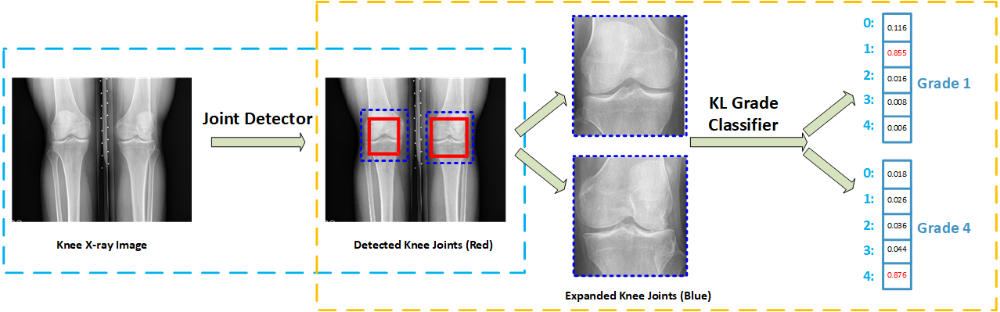

#  Knee Osteoarthritis Analysis

#### Pipeline of knee osteoarthritis grading pipeline, which includes knee joints detection and knee OA grading.



### DetJoint
- Detecting two knee joints in X-ray images using a customized YOLOv2 model.

### ClsKL
- Classifying the KL grade of detected knee joints with a novel ordinal loss.


## Data & Models
Knee joint detection (DetJoint) and KL grading (ClsKL) training/testing datasets, as well as best models, can be downloaded from [KneeXrayData](https://figshare.com/articles/KneeXrayData/8139545), around 7G.


## Citation
Please consider `cite` the paper if you use the code or data for your research.
```
@article{chen2019fully,
  title={Fully Automatic Knee Osteoarthritis Severity Grading Using Deep Neural Networks with a Novel Ordinal Loss},
  author={Chen, Pingjun and Gao, Linlin and Shi, Xiaoshuang and Allen, Kyle and Yang Lin},
  journal={Computerized Medical Imaging and Graphics},,
  volume={75},
  pages={84--92},
  year={2019},
  doi={https://doi.org/10.1016/j.compmedimag.2019.06.002},
  publisher={Elsevier}  
}
```
